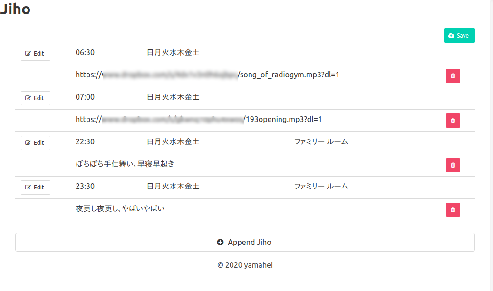

Jiho
====

概要
----

Let google Home speak at the specified time

Google Homeを定時に喋らせます。
音楽を鳴らすこともできます。

Raspberry piで使うことを前提に作っているため、Windows環境では意図的にエラーを出していますのでご注意ください。

音声合成に[Voice RSS](http://www.voicerss.org/)を使っています。
APIキーを環境変数`VOICERSS_APIKEY`にセットしておいてください。



音楽を鳴らす場合は、MP3ファイルへのURLを指定してください。
未確認ですがHTTPSじゃないと鳴らない気がします。。

セットアップ
------------
### Rubyのインストール

Rubyは2.7系以上が無難です。
Bundlerも併せてインストールしてください。

### アプリのインストール

```
$ git clone https://github.com/yamahei/jiho.git
$ cd jiho
$ bundle install
```

### mDNS（avahi-browseコマンド）のインストール

```
$ sudo apt-get install avahi-daemon libnss-mdns avahi-utils
```


起動
----

```
$ bundle exec ruby app.rb
```
[http://localhost:4567/](http://localhost:4567/)で時報編集画面が開きます。
ラズパイで動かしている場合は`localhost`部分はラズパイのIPを指定してください。

----

ラズパイでサービス化したメモ
----------------------------

### ユーザpiの環境変数にVoiceRSSのAPIKeyをセット

```
nano ~/.bashrc
+ VOICERSS_APIKEY=YOUR_VOICERSS_APIKEY
```

### 起動コマンドを作成

```bash
$ sudo mkdir -p /opt/jiho/bin
$ sudo nano /opt/jiho/bin/startjiho.sh

  #!/bin/bash

  su - pi
  cd /home/pi/jiho
  /home/pi/.rbenv/shims/bundle exec /home/pi/.rbenv/shims/ruby /home/pi/jiho/app.rb

$ sudo chmod +x /opt/jiho/bin/startjiho.sh
```

### サービスの定義を作成

```bash
$ sudo nano /lib/systemd/system/jiho.service

  [Unit]
  Description = jiho

  [Service]
  ExecStart=/opt/jiho/bin/startjiho.sh
  Restart=always
  Type=simple

  [Install]
  WantedBy=multi-user.target

$ sudo systemctl daemon-reload
$ sudo systemctl enable jiho
```

### 起動

```bash
$ sudo systemctl start jiho
```

### ログ

```bash
$ sudo journalctl -f -u jiho
```


その他（言い訳）
----------------

### 作り始めた動機

このアプリは、元々[noelportugal/google-home-notifier](https://github.com/noelportugal/google-home-notifier)を改造して作ったアプリ[yamahei/google-home-notifier](https://github.com/yamahei/google-home-notifier)で運用していました。
最近調子が悪いのと、コードの取り回しが良くないので、Rubyで作り直そう、というのが発端です。

### 泥臭い実装

mDNSとCASTV2をクリアしなくてはいけないのですが、情報が少なく、やっと見つけた[julbouln/rubycast](https://github.com/julbouln/rubycast)を元に[yamahei/rubycast](https://github.com/yamahei/rubycast)を作りました。
これはこれで、GoogleHomeの名前を指定してメッセージ（or MP3）を流せるのですが、Eventmachineのネストの問題があり、複数台のGoogleHomeでの運用を解決できず、断念しました。

このため、本アプリもかなり泥臭い実装になっています。
mDNSは[jiho/lib/search_googlehome.rb](https://github.com/yamahei/jiho/blob/main/lib/search_googlehome.rb)でコマンド化、CASTV2は[jiho/lib/send_googlehome.rb](https://github.com/yamahei/jiho/blob/main/lib/send_googlehome.rb)でコマンド化して、別プロセスで動かしています。

### まだ怪しい挙動

ひとまず試験運用として動かしていますが、テキスト読み上げを連続で投げると喋らなくなったりします。
これはCASTV2の終了処理がイマイチな可能性と、（Text To Speechではなく）Google Translate TTSの応答の可能性があります。


喋らなくなった対応
------------------

* STT直たたきだと喋るのにJiho経由だと喋らなくなった
  * [go-chromecast](https://github.com/vishen/go-chromecast)というのがあるらしい→実験する（良かったら採用
    * これはこれで良いツール
* 原因はGoogleが機械的なリクエストを拒否するようになったからだった
* 別のAPIサービス検討
  * [Voice RSS](http://www.voicerss.org/) が使いやすそう
    * フリープランでも350リクエスト/日使えるので、Jihoには十分
    * 「音声でも」を「おとこえ でも」って読んじゃうのはいけてない→運用で対処

